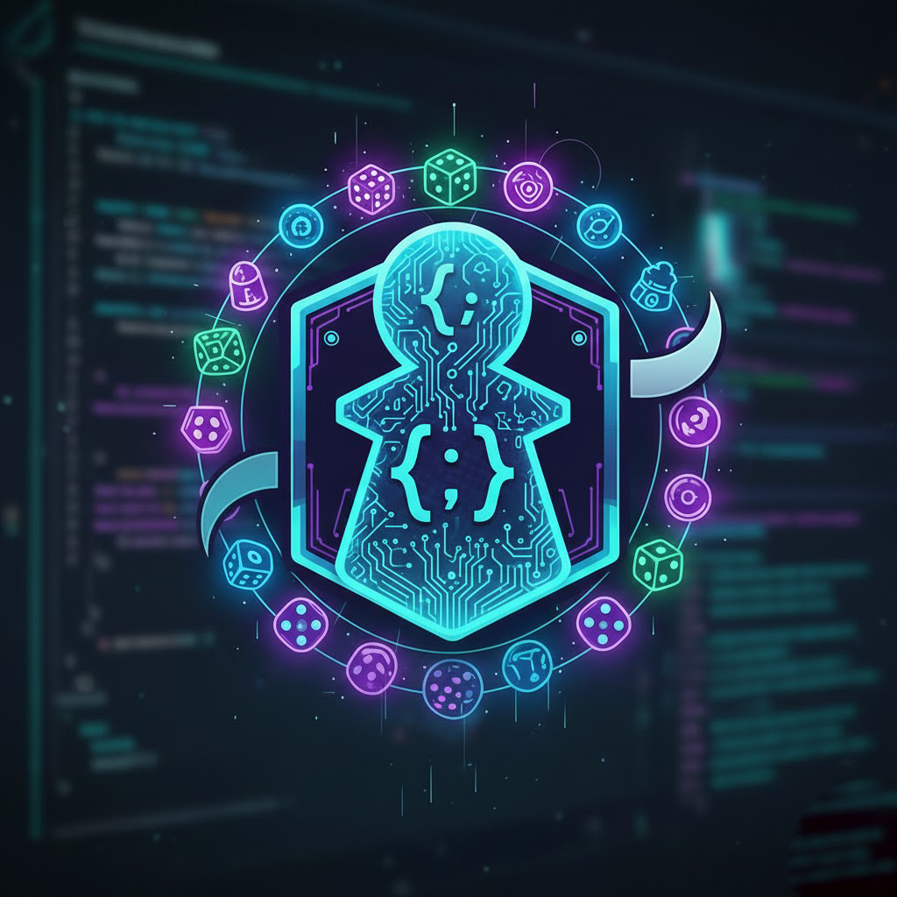
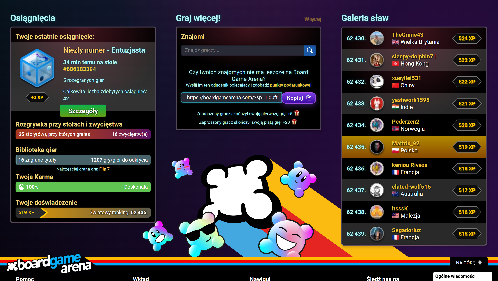
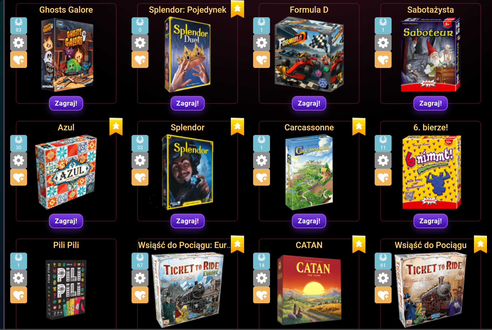
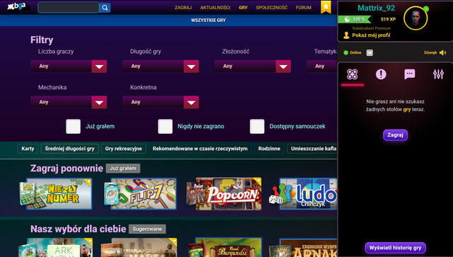
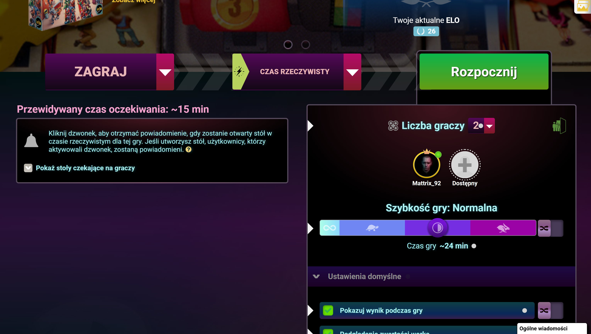

THEMES STYL CSS by Mattrix_92

 

 
 

  
  

  
  

Follow these steps to apply the Dark Neon style:

> ⚡ **Step 1:** Go to **Settings** in your account on Board Game Arena.  
> ⚡ **Step 2:** Select **Advanced**.  
> ⚡ **Step 3:** Paste the following code and **Save**:
